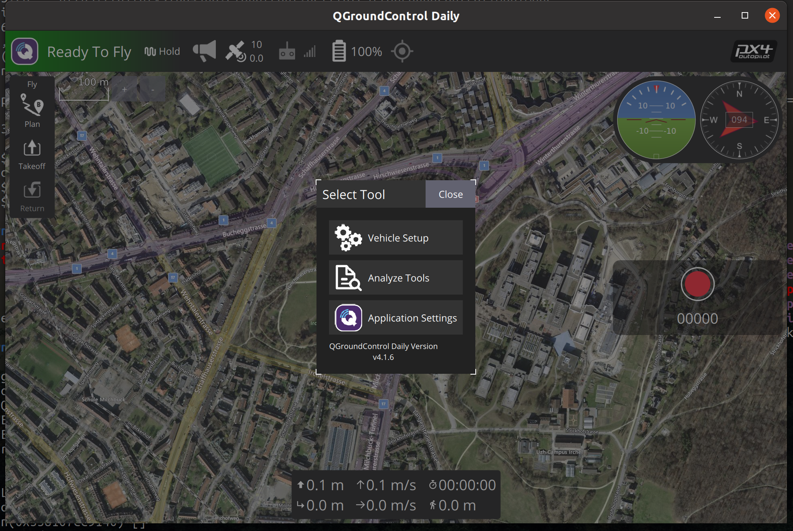
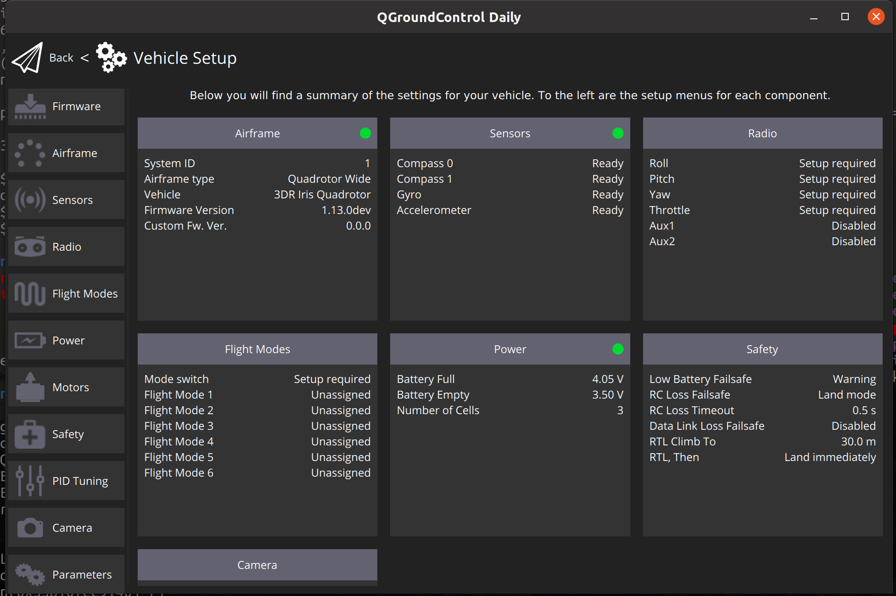
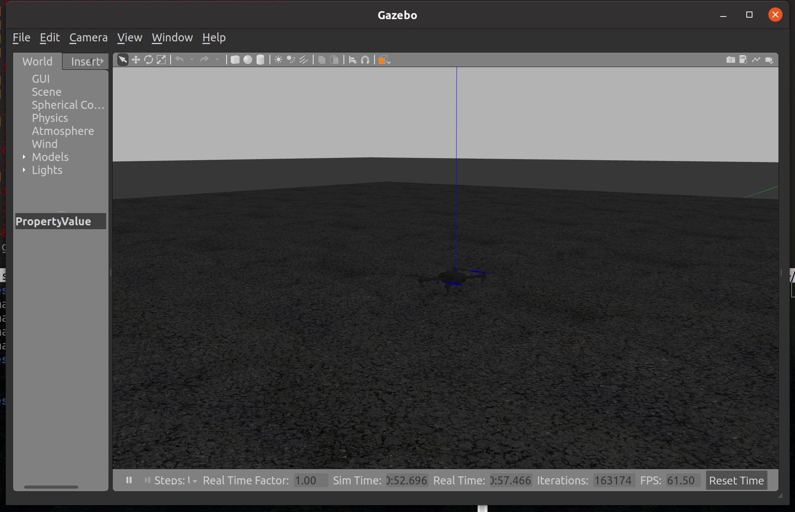
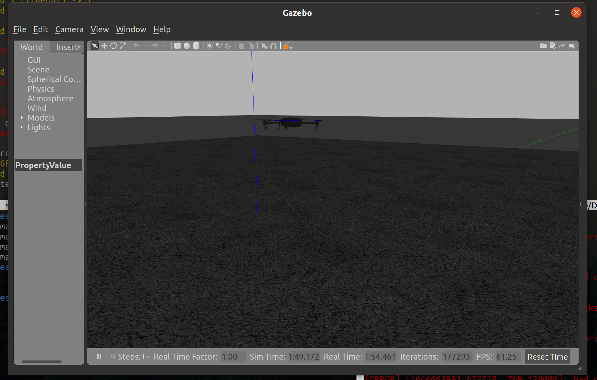

# setup instructions

## Install ROS
These instructions are for Ros Noetic on Ubuntu 20.04.

Setup keys, update apt, and install ros desktop:
```bash
    sudo sh -c 'echo "deb http://packages.ros.org/ros/ubuntu $(lsb_release -sc) main" > /etc/apt/sources.list.d/ros-latest.list'
    sudo apt install curl # if you haven't already installed curl
    curl -s https://raw.githubusercontent.com/ros/rosdistro/master/ros.asc | sudo apt-key add -
    sudo apt update
    sudo apt install ros-noetic-desktop-full
    echo "source /opt/ros/noetic/setup.bash" >> ~/.bashrc
    source ~/.bashrc
```

Now we need to install some additional dependencies, and rosdep.
```bash
    sudo apt install python3-rosdep python3-rosinstall python3-rosinstall-generator python3-wstool build-essential
    sudo rosdep init
    rosdep update
    sudo sh     -c 'echo "deb http://packages.ros.org/ros/ubuntu `lsb_release -sc` main" \
         > /etc/apt/sources.list.d/ros-latest.list'
    wget http://packages.ros.org/ros.key -O - | sudo apt-key add -
    sudo apt-get update
    sudo apt-get install python3-catkin-tools
```

Now we create our ros workspace. There will be errors and warnings, this is fine as our ```catkin_ws/src``` is empty so there is nothing to build.
```bash
    mkdir catkin_ws
    cd catkin_ws/
    catkin init --workspace .
    catkin build
```

There may be some red errors from catkin build which inform us that our directory does not have any packages in it yet.

## Install PX4 Sim

We need more dependencies:
```bash
    sudo apt install software-properties-common apt-transport-https wget
    sudo apt install python3-rosdep python3-rosinstall python3-rosinstall-generator python3-wstool build-essential -y
    sudo apt-get install python-catkin-tools python-rosinstall-generator -y
    rosinstall_generator --rosdistro noetic mavlink | tee /tmp/mavros.rosinstall
    rosinstall_generator --upstream mavros | tee -a /tmp/mavros.rosinstall
    sudo apt install ros-noetic-mavros
    sudo apt-get install python3-rosdep
```

The final set of dependencies:
```bash
   rosdep install --from-paths src --ignore-src -r -y
   sudo apt install geographiclib-tools -y
   install_geo=$(wget https://raw.githubusercontent.com/mavlink/mavros/master/mavros/scripts/install_geographiclib_datasets.sh -O -)
   catkin build
   sudo apt-get install protobuf-compiler libeigen3-dev libopencv-dev -y
```

Note that we do not clone the PX4-autopilot in catkin/src as it is not really a ROS package.

Now we can download and install the PX4 firmware simulator:
```bash
    git clone https://github.com/PX4/PX4-Autopilot.git --recursive
    bash ./PX4-Autopilot/Tools/setup/ubuntu.sh
```

Next we need to build the simulator, sitl refers to "software in the loop". The following lines of code need to be run in the PX4 Firmware's directory, which on you machine is likely: ```~/catkin_ws/PX4-Autopilot```.

```bash
DONT_RUN=1 make px4_sitl_default gazebo
source ~/catkin_ws/devel/setup.bash    # (optional)
source Tools/setup_gazebo.bash $(pwd) $(pwd)/build/px4_sitl_default
export ROS_PACKAGE_PATH=$ROS_PACKAGE_PATH:$(pwd)
export ROS_PACKAGE_PATH=$ROS_PACKAGE_PATH:$(pwd)/Tools/sitl_gazebo
roslaunch px4 mavros_posix_sitl.launch
```

```make clean``` May be needed if build fails or you need to rebuild, this will clean previously built code.

If everything went well we should see Gazebo opening with a UAV on the ground.

## Mavros
The first time you run mavros it will have an error about geographic libs not being setup. There is a script to install these stored in ```/opt/ros/noetic/lib/mavros``` called ```install_geographiclib_datasets.sh```. Run this script ```sudo ./install_geographiclib_datasets.sh``` and the geographic lib data will be installed.

Mavros should already be installed. You can check by finding its installation location with ```roscd mavros``` and you will find yourselves in the Mavros directory.

Check everything is ok by subscribing to a topic. Note not all topics are used, but either of the following should be active, check using ```rostopic echo``` followed by either ```/mavros/local_position/pose``` or ```/mavros/imu/data_raw```.

# Take off, land, go places

## QGroundControl

you need to download and install QGroundControl.

Set user permissions:

```bash
sudo usermod -a -G dialout $USER
sudo apt-get remove modemmanager -y
sudo apt install gstreamer1.0-plugins-bad gstreamer1.0-libav gstreamer1.0-gl -y
sudo apt install libqt5gui5 -y
```

Download by (or look for the latest version yourself):
```bash
wget https://d176tv9ibo4jno.cloudfront.net/latest/QGroundControl.AppImage
```

Open QGroundControl:

```
./QGroundControl.AppImage
```

Your simultion needs to be running to connect to QGroundControl

A connected QGroundControl will look like:


Click the "Q" in the corner,



Select ```Vehicle Setup```



Select ```Parameters``` from the bottom of the left hand tool bar


Search for ```COM_RCL_EXCEPT``` and set value to ```4```.

## Running Everything

We are now ready to fly!



In ```src``` folder there are python scripts for ```fake_mocap.py``` and to control pose. This is needed to move to "OFFBOARD" mode. Python files are run by:

```bash
python3 fake_mocap.py
```

To successfully go offboard we need to publish a target position, 

```bash
python3 simple_pose_publisher.py
```

We can arm and go "OFFBOARD" either calling MAVROS services:

ARM: 
```bash
rosservice call /mavros/cmd/arming "value: true" 
```

```bash
rosservice call /mavros/set_mode "base_mode: 0
custom_mode: 'OFFBOARD'" 
```

```bash
rosservice call /mavros/cmd/arming "value: true" 
```



## More advanced
in ```src``` there is a script ```pose_demo.py``` this program will move the UAV in a square, as well as automatically arming and go offboard. Check out this file to consider more complicated control methods.

# Additional Worlds
In the folder ```worlds``` there is an alternate world ```mrac_world.world```. If you copy this to ```PX4-Autopilot/Tools/sitl_gazebo/worlds/```, you will need to update the world arg in the launch file, ```PX4-Autopilot/<somewhere here>```.

# Realsense

**Not needed initially**

Download github repo:
git@github.com:IntelRealSense/realsense-ros.git

Make sure you use a good quality cable, and some laptops may have issues with supplying enough power through their USB ports.
